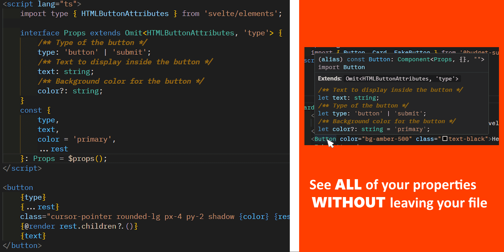

# SvelteDoc


> Generate and maintain component documentation blocks for your Svelte 5 components directly in your source files. The docs appear at the top of the file and show up in hovers when you use the component elsewhere.

## What it does

- Parses your Svelte component's TypeScript to discover props from `$props()` typed destructuring.
- Finds the props type alias (e.g., `Props`, `ButtonProps`) or falls back to patterns like `*Props`.
- Builds a single `<!-- @component ... -->` block at the top of the file.
- Preserves your free-form description text across runs and updates only the generated parts.
- Supports extended/union types via intersections (e.g., `HTMLAttributes<...> & { ... }`).




> **Suggestions are welcome!** Please create an issue on the GitHub repo and your suggestion will be taken into consideration!

# Index
* [What it does](#what-it-does)
* [Commands](#commands)
* [Settings](#settings)
* [File matching guide](#file-matching-guide)
* [Output channel](#output-channel)
* [How it works](#how-it-works)
* [Notes](#notes)
* [Troubleshooting](#troubleshooting)
* [References](#references)
* [Release Notes](#release-notes)

## Commands

- `SvelteDoc: Document Current File`
	- Runs on the active editor when it's a `.svelte` file and will add the component documentation to the top of the file.

## Settings

While SvelteDoc works out of the box and is configured for the most productive settings, there are multiple options under the `sveltedoc` namespace.

1. `sveltedoc.documentOnSave` (boolean, default: **true**)
	- Run documentation generation whenever a matching `.svelte` file is saved.

2. `sveltedoc.filesToDocument` (string[], default: **["\*\*/components/\*\*"]**)
	- Glob-like patterns for files/folders where docs should run. **Only `.svelte` files are processed**.

3. `sveltedoc.propertyNameMatch` (string[], default: **["\*Props"]**)
	- Fallback patterns for the props type alias when it can't be inferred from `$props()`.
	- Works with both `type` and `interface` declarations (e.g., `type ButtonProps = {...}` or `interface ButtonProps { ... }`).

4. `sveltedoc.addDescription` (boolean, default: **true**)
	- Include an editable description section in the @component block.
	- Changes to this section will be persisted, while the props will always be auto-generated from the JSDoc comments.

5. `sveltedoc.placeDescriptionBeforeProps` (boolean, default: **false**)
	- Whether to place the description before or after the props section.

6. `sveltedoc.escapeAngleBrackets` (boolean, default: **true**)
	- **IMPORTANT**: Enable this to fix formatting issues with other extensions (e.g. Auto Rename Tag).
	- When enabled, escapes angle brackets (`<` `>`) in documentation with visible placeholder characters (`◄` `►`).
	- This prevents conflicts with HTML parsing in VS Code's markdown renderer and other extensions.

## File matching guide

The extension runs on save only for files whose path matches your `sveltedoc.filesToDocument` patterns.

- Default: `["**/components/**"]`
- Only `.svelte` files are processed (the pattern filters by path, the extension then ensures the file is a Svelte file).
- Works across nested folders and monorepos. On Windows paths are normalized so forward-slash globs work.

Examples that match:

- `src/lib/components/MainView.svelte`
- `src/lib/components/Some/Other/Folders/Other.svelte`
- `src/Apps/MobileApp/src/lib/components/some other folder/component.svelte`
- `src/components/A.svelte`
- `src/components/Folder/B.svelte`

Examples that do not match:

- `src/routes/+page.svelte`
- `src/lib/RandomSvelteFile.svelte`

Tip: You can add more patterns if you keep components in different places, e.g.

```json
{
	"sveltedoc.filesToDocument": [
		"**/components/**",
		"**/src/lib/features/**"
	]
}
```

## Output channel

The extension writes detailed logs to the "SvelteDoc" output channel (View -> Output -> SvelteDoc) so you can see what it detected and changed. If there are any errors with the extension then they will be displayed here.

## How it works

1. Reads all `<script lang="ts">` blocks in the component.
2. Detects `$props()` destructuring and captures defaults and `$bindable(...)` usage.
3. Resolves the props type as a type alias or interface and parses object members, optionality, JSDoc summaries, and inherited types.
4. Renders a single `@component` block and inserts it before the first TS `<script>` tag.
5. Preserves only the description section; everything else is regenerated. If the description is placed before props, we keep lines before the `### Props` header. If the description is after props, we keep lines after the props list to the closing `-->`. The position of the description is determined by the `sveltedoc.placeDescriptionBeforeProps` setting.

## Notes

- If no props are detected, `### Props` is omitted and the block becomes description-only (still useful for hovers).
- Defaults using `$bindable(inner)` are shown as `inner`.
- Angle brackets (`<` and `>`) and apostrophes (`'`) are replaced with special characters/codes because of bugs and compatibility issues with other extensions.
 - Prop modifiers are shortened and placed at the beginning of the property name.
 	- `!` = required
	- `$` = bindable
	- Example: `!$ name string - <description_here>` is a required **string** property called **name** and can be bound using `$bindable('some string here')`.

## Troubleshooting

- Nothing happens on save:
	- Ensure the file path matches `sveltedoc.filesToDocument`.
	- Confirm the file has `<script lang="ts">` blocks.
	- Check the SvelteDoc output channel for diagnostics.
- `<script>` tag is corrupted after saving.
	- This seems to be an intermittent bug caused by the **Auto Rename Tag** extension. This is why the angle brackets and apostrophes are replaced with special characters.
	- Please report this issue if you run into it and provide your type definition, including the JSDoc comments you are using.

> Please report any bugs to the GitHub issues page for them to be triaged and fixed.

## References

Here is a list of references that helped me build this extension.
- [Svelte Type Safety](https://svelte.dev/docs/svelte/$props#Type-safety): Outlines how to properly type your component properties.
- [Svelte Component Documentation](https://svelte.dev/docs/svelte/faq#How-do-I-document-my-components): Provides an example of how to create component documentation.

## Release Notes

> Please see the changelog for release notes.
[Changelog](CHANGELOG.md)

## License

See [LICENSE](LICENSE).
