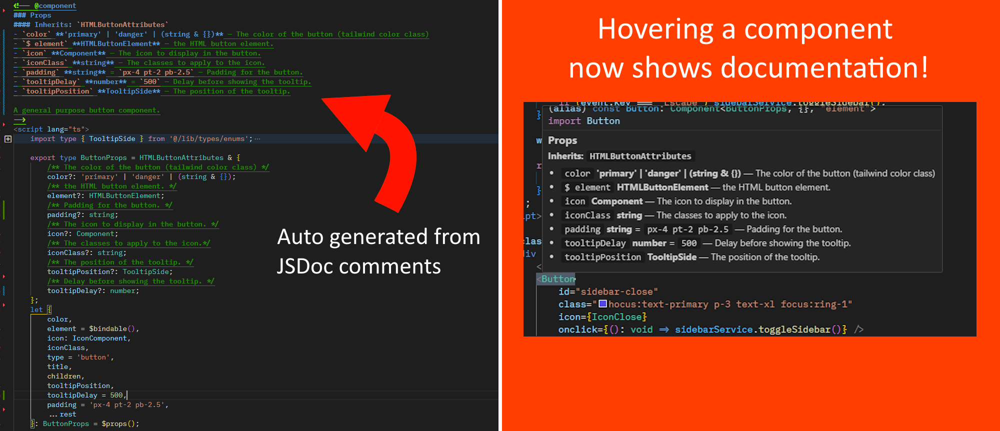

# SvelteDoc

> **Intelligent hover tooltips for your Svelte 5 components** — See component props, types, and JSDoc comments without leaving your workflow.

## What it does

Hover over any Svelte component tag to instantly see:
- **Props** extracted from `$props()` type annotations
- **Type information** including complex TypeScript types and generics
- **JSDoc comments** explaining each prop
- **Default values** and `$bindable()` indicators
- **Inherited types** from extended interfaces

No need to jump between files or generate documentation blocks — SvelteDoc brings the information to you.



> **Suggestions are welcome!** Please create an issue on the GitHub repo and your suggestion will be taken into consideration!

---

## Table of Contents
* [Quick Start](#quick-start)
* [Features](#features)
* [Best Practices](#best-practices)
  * [Path Resolution](#path-resolution)
  * [Workspace Packages](#workspace-packages)
* [Configuration](#configuration)
* [Commands](#commands)
* [Troubleshooting](#troubleshooting)
* [Migration from v1](#migration-from-v1)
* [Requirements](#requirements)
* [References](#references)

---

## Quick Start

**1. Create a component with typed props:**

```svelte
<!-- Button.svelte -->
<script lang="ts">
	interface Props {
		/** Button text to display */
		label: string;

		/** Visual style variant */
		variant?: 'primary' | 'secondary';

		/** Click handler */
		onClick?: (event: MouseEvent) => void;
	}

	const { label, variant = 'primary', onClick }: Props = $props();
</script>

<button class={variant} onclick={onClick}>
	{label}
</button>
```

**2. Import and use the component:**

```svelte
<!-- App.svelte -->
<script lang="ts">
	import Button from './Button.svelte';
</script>

<!-- Hover over "Button" to see prop documentation -->
<Button label="Click me" variant="secondary" />
```

**3. See the magic!** Hover over `<Button` and see a tooltip with:
- `label: string` — Button text to display ⚠️ (required)
- `variant?: 'primary' | 'secondary'` — Visual style variant (default: `'primary'`)
- `onClick?: (event: MouseEvent) => void` — Click handler

---

## Features

- **🎯 Intelligent Prop Extraction** — Parses multi-line properties, nested types, TypeScript utilities, and JSDoc comments automatically.
- **⚡ Smart Import Resolution** — Resolves relative imports, tsconfig aliases, and workspace packages seamlessly.
- **📊 Customizable Tooltips** — Choose between bullet list, table, or code block formats with four sorting options.
- **⚡ Performance Optimized** — In-memory caching with automatic invalidation keeps tooltips fast and accurate.

---

## Best Practices

### Path Resolution

SvelteDoc resolves imports intelligently. Here's how to configure your project for best results:

#### Relative Paths
Works out of the box:
```typescript
import Button from './Button.svelte';
import Card from '../components/Card.svelte';
```

#### tsconfig.json Path Aliases
Define aliases in your `tsconfig.json` or `jsconfig.json`:

```json
{
	"compilerOptions": {
		"paths": {
			"$lib/*": ["./src/lib/*"],
			"@components/*": ["./src/components/*"],
			"@utils/*": ["./src/utils/*"]
		}
	}
}
```

Then use them in imports:
```typescript
import Button from '$lib/components/Button.svelte';
import Card from '@components/Card.svelte';
```

SvelteDoc will automatically:
- Find your tsconfig.json
- Resolve the alias to the actual file path
- Try multiple extensions (`.svelte`, `.ts`, `.js`)
- Check for index files if the path is a directory

#### SvelteKit Projects
SvelteKit automatically configures `$lib` alias. Just use it:
```typescript
import Button from '$lib/components/Button.svelte';
```

### Workspace Packages

For monorepos using **pnpm workspaces**, SvelteDoc provides advanced barrel file resolution.

#### Setting up a Shared Package

**1. Create workspace structure:**
```
project-root/
├── pnpm-workspace.yaml
├── packages/
│   ├── shared/
│   │   ├── package.json
│   │   └── src/
│   │       ├── index.ts          # Barrel file
│   │       └── components/
│   │           ├── index.ts      # Nested barrel
│   │           ├── Button.svelte
│   │           └── Card.svelte
│   └── app/
│       ├── package.json
│       └── src/
│           └── App.svelte
```

**2. Configure `pnpm-workspace.yaml`:**
```yaml
packages:
  - 'packages/*'
```

**3. Set up `package.json` with exports:**
```json
{
	"name": "@myorg/shared",
	"exports": {
		".": {
			"svelte": "./src/index.ts",
			"default": "./src/index.ts"
		},
		"./components": {
			"svelte": "./src/components/index.ts",
			"default": "./src/components/index.ts"
		}
	}
}
```

**4. Create barrel files:**

`packages/shared/src/index.ts`:
```typescript
// Re-export from nested barrels
export * from './components/index.ts';
```

`packages/shared/src/components/index.ts`:
```typescript
// Named default re-exports (recommended)
export { default as Button } from './Button.svelte';
export { default as Card } from './Card.svelte';

// Or named re-exports
export { Button } from './Button.svelte';
export { Card } from './Card.svelte';
```

**5. Use in consuming packages:**
```svelte
<script lang="ts">
	// SvelteDoc will resolve through barrels automatically
	import { Button, Card } from '@myorg/shared';
</script>

<!-- Hover works! -->
<Button label="Click me" />
<Card title="My Card" />
```

> **Note:** SvelteDoc automatically resolves barrel files (re-exports) up to 2 levels deep and caches results for performance.

---

## Configuration

All settings are under the `sveltedoc` namespace:

- **`cacheExpirationMinutes`** (number, default: `30`) — Minutes of inactivity before clearing cached props. ⚠️ Higher values may increase memory usage.

- **`normaliseComment`** (boolean, default: `false`) — Remove extra whitespace from JSDoc comments for compact display.

- **`normaliseType`** (boolean, default: `true`) — Remove extra whitespace from type definitions for compact display.

- **`normaliseDefaultValue`** (boolean, default: `true`) — Remove extra whitespace from default values for compact display.

- **`tooltipOrder`** (string, default: `'required'`) — Property display order: `normal`, `alphabetical`, `required`, or `type`.

- **`tooltipFormat`** (string, default: `'code-block'`) — Tooltip format: `bullet-list`, `table`, or `code-block`.

- **`detailedResolverLogging`** (boolean, default: `true`) — Enable detailed logging for import resolution debugging. Check Output panel (View → Output → SvelteDoc).

---

## Commands

Access via Command Palette (`Ctrl+Shift+P` / `Cmd+Shift+P`):

### `SvelteDoc: Clear Cache`
Clears all cached component prop data. Useful if you see stale information after updating component types.

### `SvelteDoc: Show Output`
Opens the SvelteDoc output panel showing detailed logs of hover attempts, component resolution, and prop extraction.

---

## Troubleshooting

### "No import found for component"
**Problem:** Tooltip shows error when hovering over component tag.

**Solutions:**
- Verify the component is imported in your `<script>` block
- Check import statement syntax (both default and named imports work)
- Ensure component name matches the imported name exactly (case-sensitive)

**Example:**
```svelte
<script lang="ts">
	// ✅ Works
	import Button from './Button.svelte';
	import { Card } from './Card.svelte';

	// ❌ Won't work — no import
	// <Alert /> won't show tooltip
</script>

<Button label="Test" />
<Card title="Works" />
```

### "No $props() found"
**Problem:** Tooltip shows "No props found" even though component has props.

**Solutions:**
- Add `$props()` destructuring to your component
- Ensure `$props()` has a type annotation (`: Props` or `: { ... }`)
- Check that the type is defined in the same file or imported

**Example:**
```svelte
<!-- ❌ Won't work — no type annotation -->
<script lang="ts">
	const { label } = $props();
</script>

<!-- ✅ Works — has type annotation -->
<script lang="ts">
	interface Props {
		label: string;
	}

	const { label }: Props = $props();
</script>
```

### "Could not resolve component path"
**Problem:** Import path cannot be resolved (tsconfig alias or workspace package).

**Solutions:**
- Verify `tsconfig.json` or `jsconfig.json` has correct `paths` configuration
- For workspace packages, ensure `pnpm-workspace.yaml` exists and references the package
- Check `package.json` has properly configured `exports` field
- Enable `detailedResolverLogging` setting and check Output panel for details

**Check Output Panel:**
1. Open Command Palette (`Ctrl+Shift+P` / `Cmd+Shift+P`)
2. Run "SvelteDoc: Show Output"
3. Look for resolver logs showing which paths were tried

### Stale or Incorrect Information
**Problem:** Tooltip shows outdated props after changing component definition.

**Solutions:**
- Run command: "SvelteDoc: Clear Cache"
- Check if file was saved (cache validates via modification time)
- Adjust `cacheExpirationMinutes` setting for faster expiration

---

## Migration from v1

**v2.0.0 is a complete rewrite** with a fundamentally different approach:

### What Changed
- ❌ **Removed:** Automatic `<!-- @component -->` block generation
- ❌ **Removed:** Save-triggered documentation updates
- ❌ **Removed:** File pattern matching (`filesToDocument` setting)
- ✅ **Added:** Real-time hover tooltips showing component props
- ✅ **Added:** Path alias and workspace package resolution
- ✅ **Added:** Customizable tooltip formats and sorting

### Why the Change?
v1 modified your source files by inserting documentation blocks. v2 takes a **non-invasive approach**:
- **Cleaner files** — No generated documentation blocks cluttering your components
- **Always up-to-date** — Hovers reflect current code, not stale generated docs
- **Zero maintenance** — No need to regenerate docs when types change

### How to Migrate
1. **Remove old `@component` blocks** (optional — they won't interfere, but aren't needed)
2. **Ensure your components use `$props()` with type annotations** (same as v1)
3. **Hover over component tags** to see the new tooltip experience

That's it! Your existing components will work immediately.

---

## Requirements

- **VS Code:** 1.103.0 or higher
- **Svelte:** Version 5 (uses `$props()` runes)
- **TypeScript:** Required for type annotations

---

## References

- [Svelte 5 Runes Documentation](https://svelte.dev/docs/svelte/$props)
- [Svelte Type Safety Guide](https://svelte.dev/docs/svelte/$props#Type-safety)
- [TypeScript Path Mapping](https://www.typescriptlang.org/docs/handbook/module-resolution.html#path-mapping)

---

## License

See [LICENSE](LICENSE).
